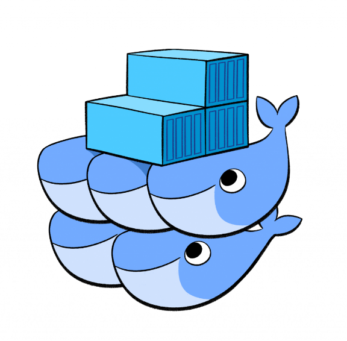

# Docker para Desenvolvedores  
Criando ambientes profissionais completos com Docker, que é a principal tecnologia de containers atualmente no mercado.  

  

## Docker  
É uma ferramenta que se apoia em recursos existentes no kernel, inicialmente Linux, para isolar  
a execução de processos. As ferramentas que o Docker traz são basicamente uma camada de  
administração de containers, baseado originalmente no LXC.  

 -  Não é um sistema de virtualização tradicional: possuem menos camadas do ponto de vista de arquiteturas, forma de implementação e funcionamentos diferentes;
 
 - Engine de administração de containers: faz gerenciamento de uma ou mais instâncias (container) sendo executadas ao mesmo tempo;
  
Alguns isolamentos possíveis:

- Isolamento no uso de memória, CPU, I/O, Rede (que redes e portas são acessíveis), File System.  
- Permissões e Políticas  
- Capacidades do kernel  

Podemos ver que o sistema do Docker é dividido basicamente em três camadas:

**Client:** Permite aos usuários interagir com o Docker e acessar os containers via linha de comando ou API Remota.

**Host:** Fornece um ambiente completo para executar aplicativos, sendo composto pelo Daemon, imagens, containers, rede e volumes. O Daemon é responsável por todas as ações relacionadas aos containers e recebe comandos por meio do Client.

**Registry:** São serviços que fornecem locais de onde irá armazenar e baixar as imagens. Em outras palavras, o Registry, contém os repositórios Docker que hospedam as imagens, como Docker Hub.

O Docker possui uma **arquitetura de client-server (cliente – servidor)**, onde os containers são armazenados em um servidor chamado de Docker Host. O servidor por sua vez, é responsável por todas as ações relacionadas à containers.

**O Docker host** pode ser local ou remoto (ou seja, uma máquina física ou uma máquina virtual) e tem a capacidade de gerenciar os containers e pode servir para cada cliente um ou mais containers.

#### Quais os beneficios e vantagens de utilizar o Docker ?

-   O Docker possibilita o empacotamento de uma aplicação ou ambiente inteiro dentro de um container, e a partir desse momento o ambiente inteiro torna-se portável para qualquer outro Host que contenha o Docker instalado.
-   Isso reduz drasticamente o tempo de deploy de alguma infraestrutura ou até mesmo aplicação, pois não há necessidade de ajustes de ambiente para o correto funcionamento do serviço, o ambiente é sempre o mesmo, configure-o uma vez e replique-o quantas vezes quiser.
-   Outra facilidade do Docker é poder criar suas imagens (containers prontos para deploy) a partir de arquivos de definição chamados Dockerfiles.

## Containers (Definição oficial)

Docker empacotam componentes de software em um sistema de arquivos completo, que contêm tudo necessário para a execução: código, runtime, ferramentas de sistema - qualquer coisa que possa ser instalada em um servidor. Isto garante que o software sempre irá executar da mesma forma, independente do seu ambiente.

>  :information_source: Podemos concluir dizendo que estes recursos já existiam no kernel a um certo  
tempo, o que o Docker nos trouxe foi uma maneira simples e efetiva de utiliza-los.  
https://www.docker.com/what-docker  

> :information_source: Virtual Machine (máquina virtual), recurso extremamente usado atualmente para isolamento de
serviços, replicação e melhor aproveitamento do poder de processamente de uma máquina
física

#### Devo trocar então minha VM por um container? 

Os containers Docker possuem algumas limitações em relação as VMs:

- Todas as imagens são linux, apesar do host poder ser qualquer SO que use ou emule um kernel
linux, as imagens em si serão baseadas em linux.

- Não é possível usar um kernel diferente do host, o Docker Engine estará executando sob
uma determinada versão (ou emulação) do kernel linux, e não é possível executar uma versão
diferente, pois as imagens não possuem kernel.

Este conteúdo é baseado no curo [Docker: Ferramenta essencial para Desenvolvedores](https://www.udemy.com/course/curso-docker/).    

---    
#### Aaaah, se curtiu, não esquece de deixar a :star:
___