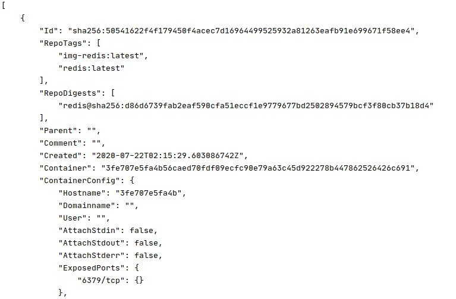

# Docker Host


Quando executamos o docker dentro de um S.O Linux, como o Docker é baseado no Linux Containers (LXC) então o docker host é o próprio sistema operacional. 

Um outro ponto, é quando executamos o Docker, em um S.O diferente do Linux, ou seja, MacOS ou Windows. Para estes casos é criada um VM Linux de forma transparente para o usuário, que provê a comunicação para o funcionamento dos rescursos necessários.

> Para o Windows 10 foi implementado uma interface que permite a excução do Docker de forma equivalente ao Linux, sendo assim não é necessário a criação de uma VM como nos cenárops anteriores. 

### Containers

1. Hello World ```docker container run hello-world```
2. Modo *Daemon* ou *Interativo*
3. Run: Sempre cria novos conteiners, o comando ```docker run --rm debian bash --version``` remove apos execução.
4. containers com nomes unicos (hash de 256 caracteres, mas podem ser criados identificadores mais legíveis para facilitar o reuso).

- ```docker run --help``` -> ```--name``` 

5. reutilizar containers

- ```docker ps -a``` ou ```docker container ls -a```
- ```docker container start -ai {{name-container}}```

Observação: alguns comando terão um mesmo resultado, pois são alias, devido a mudanças de sintaxe após 1.13 do Docker.

6. mapeamento de porta e volumes ``docker container run -p 8080:80 -v $(pwd)/html:/usr/share/nginx/html nginx``

### Images

- Verificar as imagens disponiveis na sua maquina: ``` docker image ls```
- Baixando uma nova imagem: ```docker image pull {{nome da imagem}}:latest```
- Verificado caracteristicas da imagem: ```docker image inspect {{nome da imagem}}:latest```

Após a exeução devemos ter algo parecido com esta imagem:



- Adicionando uma nova imagem com uma tag: ```docker image tag {{nome da imagem}}:latest {{tag desejada}}```

Após a exeução devemos ter algo parecido com esta imagem:


- Apagando uma imagem: ```docker image rm {{id da imagem}}```